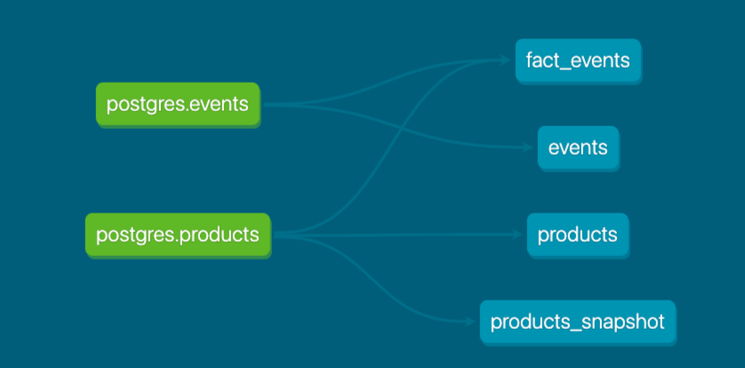

Part 1. Models 

1. What is our user repeat rate? 

A: 79.83%
Query:
    with user_order_cnt AS (
        select user_id, COUNT(order_id) AS orders
        from DEV_DB.DBT_JAYMOLOCOCOM.ORDERS
        group by 1
    )

    select div0(COUNT_IF(orders >= 2), COUNT(1)) * 100 AS user_repeat_rate 
    from user_order_cnt

2. What are good indicators of a user who will likely purchase again? What about indicators of users who are likely NOT to purchase again? If you had more data, what features would you want to look into to answer this question?

A: If a user ordered multiple times in the recent past, then it's a good indicator that the user will likely purchase again. For users with no purchase history at all, they are likely to not purchase. 
   If I had more data on more user-specific traits like age, gender and income, I'd be intereated in looking at those metrics to answer this question. 

3. Explain the product mart models you added. Why did you organize the models in the way you did?

A: I've added a product mart model called 'fact_events' that contains the time series data of users, products, and events. This enables an analysis of a question, such as "Does user's purchase behavior change based on the price of the product?"

4. Use the dbt docs to visualize your model DAGs to ensure the model layers make sense

Part 2. Tests 

1. What assumptions are you making about each model? (i.e. why are you adding each test?)

A: For `fact_events`, my assumption is that there is a product information associated with every event, so there'd be no NULLs for product information.

2. Did you find any “bad” data as you added and ran tests on your models? How did you go about either cleaning the data in the dbt model or adjusting your assumptions/tests?

A: Yes, I did find bad data, where product information were populated as NULL. I was able to detect this by adding not_null tests to the product-related columns as defined in the `_product__models.yml` file.
   To clean the data, I've revised the product_events mart model query to filter out rows where product_name is NULL since they would serve irrelevant for analysis that will be done at the product-level.
   After revising, I've ran `dbt build -s fact_events` and all the tests were passed.

Before:

After: 

Part 3. dbt Snapshots

1. Which products had their inventory change from week 1 to week 2? 

A: Pothos, Philodendron, Monstera, String of pearls

Query: 
    with products AS (
        select product_id, COUNT(1) AS cnt 
        from DEV_DB.DBT_JAYMOLOCOCOM.PRODUCTS_SNAPSHOT
        group by 1
        having cnt > 1
    )

    select *
    from DEV_DB.DBT_JAYMOLOCOCOM.PRODUCTS_SNAPSHOT
    where product_id IN (select product_id from products)
    order by product_id, dbt_updated_at